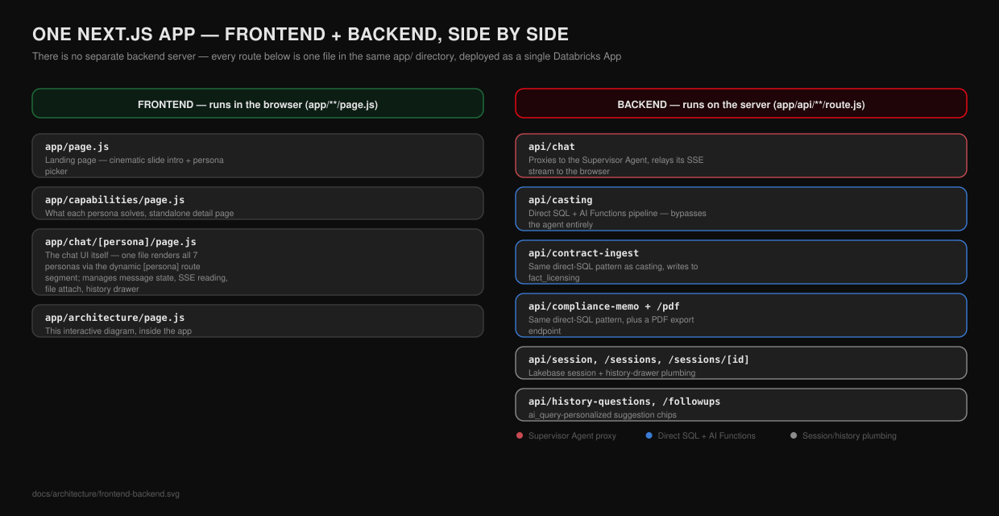
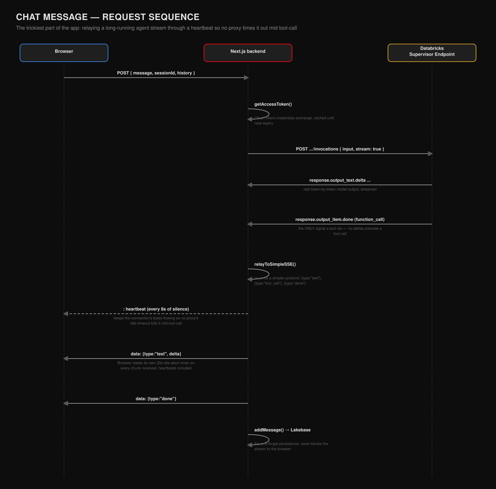
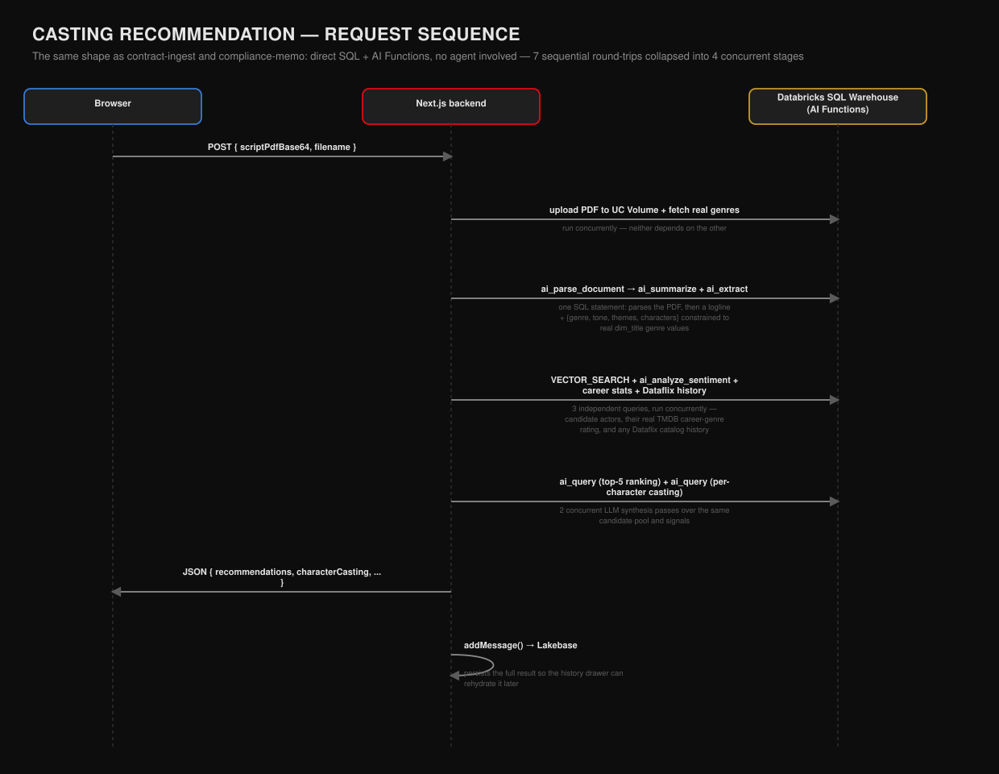

# Dataflix

**A Netflix-themed, Databricks-native AI content-strategy platform.** Real
TMDB catalog data plus synthetic licensing/engagement/marketing data, four
tuned Genie spaces, a document-AI pipeline for contracts and scripts, and a
Multi-Agent Supervisor that orchestrates all of it — wrapped in a Next.js app
styled like the product it's imagining.

Every table, function, and endpoint referenced in this repo and in the docs
below exists in the real build — nothing here is a simplified stand-in.

**Live app:** [dataflix-nextjs.vercel.app](https://dataflix-nextjs.vercel.app)

---

## What it does

| Feature | What it is |
|---|---|
| **Chat** | Five personas backed by one Supervisor Agent, each scoped to a different content-strategy angle (engagement, licensing/compliance, marketing, casting, contracts). |
| **Casting recommender** | Upload a script PDF → `ai_parse_document` + `ai_extract` pull characters, genre, and tone → candidate actors are ranked against career stats and past Dataflix performance → a per-character cast is synthesized, with duplicate-actor avoidance. |
| **Contract auto-ingestion** | Upload a signed contract PDF → `ai_extract` pulls license terms against a schema constrained to real license types and regions → fuzzy-matched against the catalog → upserted into `fact_licensing`, correctly distinguishing a renewal from a new license. |
| **Compliance memo** | Generates a regional compliance memo for a title, grounded in real content-ratings/regional-compliance regulatory documents plus Dataflix's own licensing terms — downloadable as a PDF. |
| **Architecture page** | An interactive, click-to-zoom system architecture diagram inside the app itself, styled to match the product. |
| **External grounding** | The Supervisor Agent falls back to live TMDB search/trending/financials and cross-platform trend data (Trends MCP) for anything outside Dataflix's own catalog — never fabricating an answer, always citing the source. |

## Architecture


Real TMDB data and synthetic operational data both land in Unity Catalog.
Four Genie spaces and a set of UC functions / MCP tools sit on top of that
data; a Multi-Agent Supervisor routes every question across them and
synthesizes one answer, which the Next.js app streams to the browser over
SSE. Session history persists in Lakebase.

### How the agent decides what to call


The Supervisor Agent's routing logic — when to check Dataflix's own data,
when a question needs external grounding instead, and the exact fallback
order — is real, tested behavior distilled from its live instructions. See
[`docs/supervisor-agent.md`](docs/supervisor-agent.md) for the full
configuration, every attached tool, and the complete instruction text.

The in-app `/architecture` page covers every component in more depth, with
click-to-zoom detail views, real table/function names, and the exact data
provenance (real vs. synthetic) for each piece.

## How the app itself is built

This section exists for anyone who wants to actually understand the code,
not just the product pitch above — where the frontend ends and the backend
begins, how the app authenticates to Databricks at all, and what happens
step by step on each of the two request shapes used throughout the app.

### There is no separate backend server

`app/dataflix_nextjs/` is **one** Next.js application, and Next.js's App
Router convention is what draws the frontend/backend line — not a folder
called `frontend/` and another called `backend/`. Every folder under `app/`
that contains a `page.js` is a **frontend** page: real React code that
Next.js sends to the browser, where it renders and runs. Every folder under
`app/api/` that contains a `route.js` is a **backend** endpoint: plain
Node.js code that only ever runs on the server — the browser calls it over
HTTP (`fetch("/api/chat", ...)`) exactly like it would call any external
API, it just happens to live in the same repository and deploy as the same
Databricks App.



The one frontend file worth knowing about specifically:
**`app/chat/[persona]/page.js`** is the biggest file in the app and renders
*all seven personas*. The `[persona]` folder name is Next.js's dynamic
route segment syntax — visiting `/chat/casting` or `/chat/compliance` runs
this exact same file, just with a different `persona` value read from the
URL, which is looked up in `lib/personas.js` to decide the tagline, sample
questions, and whether the attach-file flow means "upload a script" or
"upload a contract." One file, seven behaviors, driven by data.

### Authentication — how the app talks to Databricks at all

Nobody's personal credentials are baked in anywhere. Databricks Apps
auto-injects `DATABRICKS_CLIENT_ID` / `DATABRICKS_CLIENT_SECRET` for the
app's *own* service principal (a workspace identity created for the app,
not for any human). `lib/databricks.js`'s `getAccessToken()` exchanges
those for a short-lived OAuth bearer token via a client-credentials grant,
caches it until just before it expires, and every single downstream call
— running SQL, invoking the Supervisor Agent, uploading a file to a UC
Volume, minting a Lakebase database credential — uses that one token.
Separately, Databricks Apps itself sits in front of the whole app as an
SSO gate, so only people with workspace access can open it at all — but
once inside, every backend call acts as the same shared service-principal
identity, not as "you" specifically.

### Two different backend patterns

Not every feature talks to Databricks the same way — there are two
genuinely different patterns in this codebase, and knowing which one a
route uses tells you a lot about how it behaves:

1. **Agent proxy** (`/api/chat` only) — Node doesn't know anything about
   Dataflix's data. It just authenticates, forwards the question to the
   Supervisor Agent's serving endpoint, and relays whatever comes back. All
   the reasoning and tool-calling happens on the Databricks side.
2. **Direct SQL + AI Functions** (`/api/casting`, `/api/contract-ingest`,
   `/api/compliance-memo`) — Node runs actual, hand-written SQL statements
   against the warehouse, calling Databricks AI Functions
   (`ai_parse_document`, `ai_extract`, `ai_query`, ...) directly inside
   those statements. This was a deliberate choice, not an oversight: these
   three features always know exactly which tables and functions they need,
   so there's no ambiguity for an agent to resolve, and going straight to
   SQL skips the Genie/agent rate-limit quota entirely and is materially
   faster.

`lib/databricks.js`'s `runSql()` is the shared engine behind pattern 2. It's
worth understanding one specific detail: the Statement Execution API caps
`wait_timeout` at 50 seconds server-side, but `ai_parse_document`/
`ai_extract` on a real script can take longer than that, and a cold
(auto-suspended) SQL warehouse adds another 30-60 seconds of startup on top.
An earlier version of this code treated "still running" as "zero rows,"
which surfaced as a confusing "couldn't extract text from this PDF" error
that had nothing to do with the PDF — `runSql()` now polls the statement to
a real terminal state instead of trusting the first response.

### Request flow: sending a chat message



This is the trickiest piece of plumbing in the app, because a tool call
(especially a Genie query) can take ~20 seconds with **zero bytes** coming
back from Databricks during that gap — and some proxy layer between the
browser and the app has an idle-connection timeout shorter than that, which
was silently killing the stream mid-answer with no error on either side.
The fix: `relayToSimpleSSE()` in `/api/chat/route.js` races every read
against an 8-second timer and, if nothing real has arrived yet, writes an
SSE comment line (`: heartbeat`) — bytes that keep the connection alive but
that the browser's parser just ignores. The browser's own 30-second
idle-abort timer resets on every chunk it receives, heartbeats included, so
as long as heartbeats keep arriving every 8 seconds, the connection survives
no matter how long the agent takes to actually produce an answer.

### Request flow: casting, contract-ingest, and compliance memo



Casting is the richest example of the direct-SQL pattern, and
contract-ingest/compliance-memo follow the identical shape with different
specifics (extract different fields, write to a different table or
synthesize a different document). The pipeline used to be 7 SQL round-trips
run one after another; since none of steps 3-4-5 actually depend on each
other, they now run as `Promise.all()`-batched concurrent stages instead —
the single biggest fix behind "why did casting used to take over a minute."

## Repository layout

```
src/sql/              Unity Catalog DDL — catalog, schemas, all fact/dim tables
resources/             Databricks Jobs config for provisioning Unity Catalog
notebooks/             Data ingestion & synthetic data generation, in build order:
                          00 real TMDB catalog fetch
                          01 synthetic licensing/engagement/marketing data
                          02 document corpus + OCR (compliance/contract PDFs)
                          02a synthetic contract generation
                          04 multimodal poster tagging (vision-FM + face detection)
                          06-08 actor profile generation and career stats
genie/                 Genie space definitions (engagement, licensing, content
                          signals, marketing)
eval/                  MLflow evaluation harness — golden questions, scorers,
                          the eval runner used to benchmark the Supervisor Agent
docs/
  supervisor-agent.md   Live export of the Supervisor Agent's tools & instructions
  architecture/         The SVG diagrams above (system, agent routing,
                          frontend/backend split, chat & casting sequences)
app/dataflix_nextjs/    The Next.js app (Databricks App) — chat, casting,
                          contract-ingest, compliance-memo, and architecture page
```

## Tech stack

- **Data platform**: Unity Catalog, Delta Lake, Databricks Jobs
- **AI**: `ai_parse_document`, `ai_extract`, `ai_summarize`, `ai_query` and
  other Databricks AI Functions; a vision foundation model for poster tagging
- **Agent**: Databricks Agent Bricks Multi-Agent Supervisor, orchestrating
  Genie spaces, UC functions, and an external MCP service (Trends MCP)
- **App**: Next.js (App Router) on Databricks Apps, OAuth-gated, SSE
  streaming with heartbeat keepalive for long-running tool calls
- **Session storage**: Lakebase (Postgres)
- **Eval**: MLflow GenAI evaluation

## Setup

1. Provision Unity Catalog: `src/sql/` in order, or run the job in
   `resources/uc_setup.job.yml` via `databricks bundle deploy`.
2. Run the notebooks in `notebooks/` in numeric order to populate real and
   synthetic data.
3. Import the Genie spaces from `genie/` and attach them, plus the UC
   functions and Trends MCP connection described in
   [`docs/supervisor-agent.md`](docs/supervisor-agent.md), to a new
   Agent Bricks Multi-Agent Supervisor.
4. Deploy the app: `cd app/dataflix_nextjs && databricks apps deploy`, with
   the Supervisor Agent and a Lakebase instance wired in as app resources.
