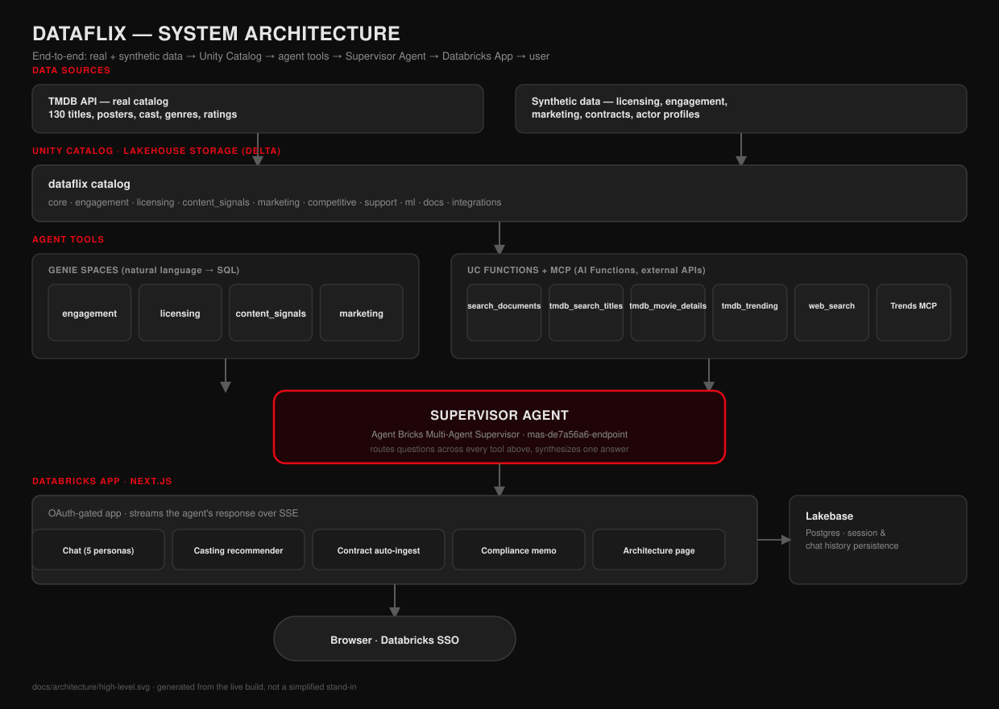
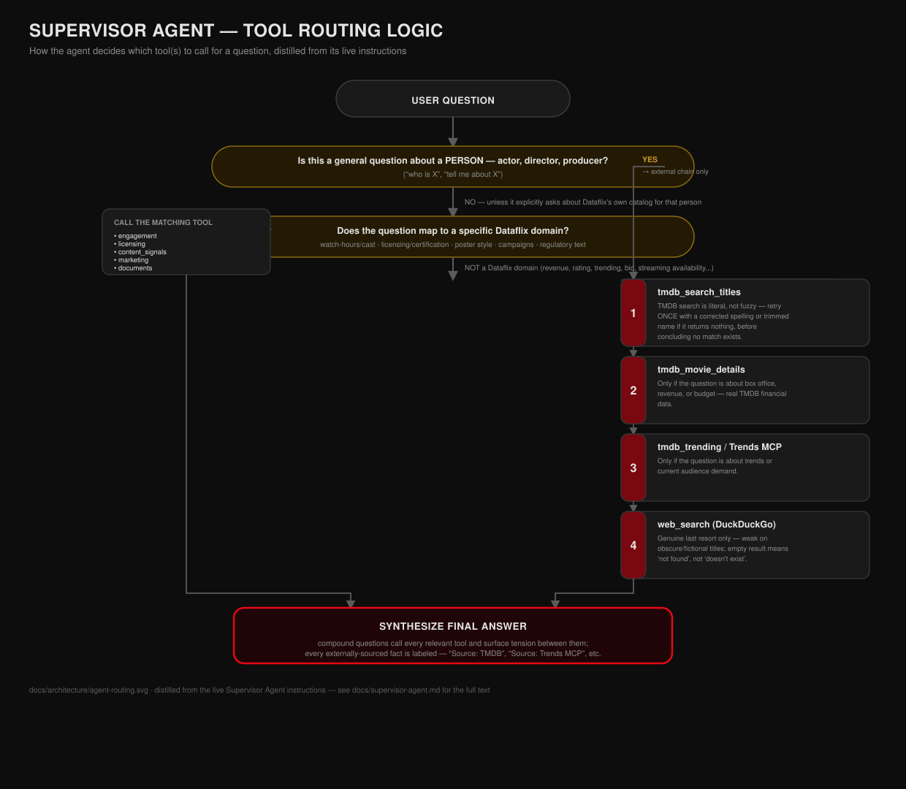

# Dataflix

**A Netflix-themed, Databricks-native AI content-strategy platform.** Real
TMDB catalog data plus synthetic licensing/engagement/marketing data, four
tuned Genie spaces, a document-AI pipeline for contracts and scripts, and a
Multi-Agent Supervisor that orchestrates all of it — wrapped in a Next.js app
styled like the product it's imagining.

Every table, function, and endpoint referenced in this repo and in the docs
below exists in the real build — nothing here is a simplified stand-in.

---

## What it does

| Feature | What it is |
|---|---|
| **Chat** | Five personas backed by one Supervisor Agent, each scoped to a different content-strategy angle (engagement, licensing/compliance, marketing, casting, contracts). |
| **Casting recommender** | Upload a script PDF → `ai_parse_document` + `ai_extract` pull characters, genre, and tone → candidate actors are ranked against career stats and past Dataflix performance → a per-character cast is synthesized, with duplicate-actor avoidance. |
| **Contract auto-ingestion** | Upload a signed contract PDF → `ai_extract` pulls license terms against a schema constrained to real license types and regions → fuzzy-matched against the catalog → upserted into `fact_licensing`, correctly distinguishing a renewal from a new license. |
| **Compliance memo** | Generates a regional compliance memo for a title, grounded in real content-ratings/regional-compliance regulatory documents plus Dataflix's own licensing terms — downloadable as a PDF. |
| **Architecture page** | An interactive, click-to-zoom system architecture diagram inside the app itself, styled to match the product. |
| **External grounding** | The Supervisor Agent falls back to live TMDB search/trending/financials and cross-platform trend data (Trends MCP) for anything outside Dataflix's own catalog — never fabricating an answer, always citing the source. |

## Architecture



Real TMDB data and synthetic operational data both land in Unity Catalog.
Four Genie spaces and a set of UC functions / MCP tools sit on top of that
data; a Multi-Agent Supervisor routes every question across them and
synthesizes one answer, which the Next.js app streams to the browser over
SSE. Session history persists in Lakebase.

### How the agent decides what to call



The Supervisor Agent's routing logic — when to check Dataflix's own data,
when a question needs external grounding instead, and the exact fallback
order — is real, tested behavior distilled from its live instructions. See
[`docs/supervisor-agent.md`](docs/supervisor-agent.md) for the full
configuration, every attached tool, and the complete instruction text.

The in-app `/architecture` page covers every component in more depth, with
click-to-zoom detail views, real table/function names, and the exact data
provenance (real vs. synthetic) for each piece.

## Repository layout

```
src/sql/              Unity Catalog DDL — catalog, schemas, all fact/dim tables
resources/             Databricks Jobs config for provisioning Unity Catalog
notebooks/             Data ingestion & synthetic data generation, in build order:
                          00 real TMDB catalog fetch
                          01 synthetic licensing/engagement/marketing data
                          02 document corpus + OCR (compliance/contract PDFs)
                          02a synthetic contract generation
                          04 multimodal poster tagging (vision-FM + face detection)
                          06-08 actor profile generation and career stats
genie/                 Genie space definitions (engagement, licensing, content
                          signals, marketing)
eval/                  MLflow evaluation harness — golden questions, scorers,
                          the eval runner used to benchmark the Supervisor Agent
docs/
  supervisor-agent.md   Live export of the Supervisor Agent's tools & instructions
  architecture/         The SVG diagrams above
app/dataflix_nextjs/    The Next.js app (Databricks App) — chat, casting,
                          contract-ingest, compliance-memo, and architecture page
PLAN.md                 The original build plan this project was built against
```

## Tech stack

- **Data platform**: Unity Catalog, Delta Lake, Databricks Jobs
- **AI**: `ai_parse_document`, `ai_extract`, `ai_summarize`, `ai_query` and
  other Databricks AI Functions; a vision foundation model for poster tagging
- **Agent**: Databricks Agent Bricks Multi-Agent Supervisor, orchestrating
  Genie spaces, UC functions, and an external MCP service (Trends MCP)
- **App**: Next.js (App Router) on Databricks Apps, OAuth-gated, SSE
  streaming with heartbeat keepalive for long-running tool calls
- **Session storage**: Lakebase (Postgres)
- **Eval**: MLflow GenAI evaluation

## Setup

1. Provision Unity Catalog: `src/sql/` in order, or run the job in
   `resources/uc_setup.job.yml` via `databricks bundle deploy`.
2. Run the notebooks in `notebooks/` in numeric order to populate real and
   synthetic data.
3. Import the Genie spaces from `genie/` and attach them, plus the UC
   functions and Trends MCP connection described in
   [`docs/supervisor-agent.md`](docs/supervisor-agent.md), to a new
   Agent Bricks Multi-Agent Supervisor.
4. Deploy the app: `cd app/dataflix_nextjs && databricks apps deploy`, with
   the Supervisor Agent and a Lakebase instance wired in as app resources.

See [`PLAN.md`](PLAN.md) for the full original design rationale.
